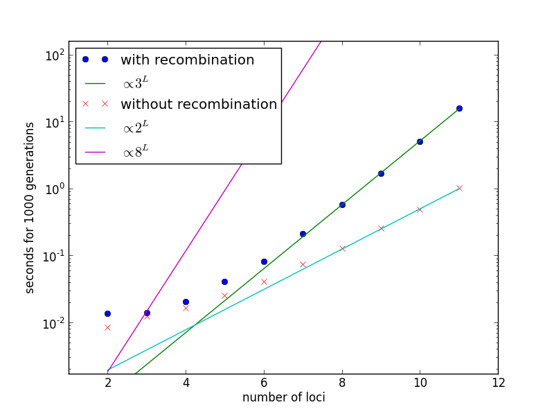

.. _Examples lowd:

Examples for the low-dimensional package
========================================
.. contents:: `Table of contents`
   :depth: 2

Various usage examples of the low-dimensional simulation package follow. Please note that they are sorted by increasing complexity.

Decay of linkage
^^^^^^^^^^^^^^^^
In recombining populations, genetic linkage decays with time and distance. This script shows the decay curves of a simple population. The example can be found in ``decay_of_LD.py``.

First, we load the FFPopSim module and the number crunchung and plotting facilities::

   import numpy as np
   import matplotlib.pyplot as plt
   import FFPopSim as h

.. note:: you might need to add the directory of the ``FFPopSim.py`` file to your Python ``PATH`` for this to work. If you decide to copy files around instead, please make sure that ``FFPopSim.py`` and ``_FFPopSim.so`` always be in the same folder.

Second, we set up the population::

   # specify parameters
   N = 500000                          # Population size
   L = 4                               # number of loci
   mu = 0.0                            # no new mutations
   r = 0.01                            # recombination rate
   
   ### set up
   pop = h.haploid_lowd(L)             # produce an instance of haploid_lowd with L loci
   pop.carrying_capacity = N           # set the steady-state population size
   pop.set_recombination_rates(r)      # assign the recombination rates
   pop.set_mutation_rates(mu)          # assign the mutation rate
   
   # initialize the population with N/2 individuals with genotypes 0, that is ----
   # and N/2 with the opposite genotype, that is ++++
   pop.set_genotypes([0, 2**L-1],[N/2, N/2])

Third, we let the population evolve in little steps and we track the linkage disequilibrium via the ``get_LD`` function::

   max_gen = 50
   LD_trajectories = [[pop.generation,pop.get_LD(0,1), pop.get_LD(0,2), pop.get_LD(0,3)]]
   for ii in range(max_gen):
       pop.evolve(5)               #N/10 generations between successive samples
       LD_trajectories.append([pop.generation, pop.get_LD(0,1), pop.get_LD(0,2), pop.get_LD(0,3)])
   LD_trajectories=np.array(LD_trajectories)

Fourth, we plot the resulting linkage disequilibrium curves::

   cols = ['r', 'b', 'g', 'm', 'c']
   for ii in range(LD_trajectories.shape[1]-1):
       plt.plot(LD_trajectories[:,0], LD_trajectories[:,ii+1], color=cols[ii], label=r'$D_{1'+str(ii+1)+'}$')
       plt.plot(LD_trajectories[:,0], np.exp(-LD_trajectories[:,0]* r * ii), ls='--', color=cols[ii])
   
   plt.legend()
   plt.xlabel('Time [generations]')
   plt.ylabel('LD $D_{ij}$')
   
   plt.ion()
   plt.show()

The typical plot we obtain is the following:

.. image:: figures/examples/decay_of_LD.png

Time complexity and scaling
^^^^^^^^^^^^^^^^^^^^^^^^^^^
Recombination is implemented in ``haploid_lowd`` in such a way that it scales with the number of loci as :math:`\mathcal{O}(3^L)` instead of the naive :math:`\mathcal{O}(8^L)`. This is shown in this example, called ``speed_lowd.py``.

First, modules and paths are imported as usual, plus the ``time`` module is imported as well::

   import time

Second, population parameters are set::

   N = 1000                        # Population size
   Lmax = 12                        # Maimal number of loci
   r = 0.01                        # Recombination rate
   mu = 0.001                      # Mutation rate
   G = 1000                        # Generations

Third, simulations of ``G`` generations are repeated for various number of loci ``L``, to show the scaling behaviour of the recombination algorithm::

   exec_time = []
   for L in range(2,Lmax):
       t1=time.time()
       ### set up
       pop = h.haploid_lowd(L)     # produce an instance of haploid_lowd with L loci
       pop.carrying_capacity = N   # set the population size
   
       # set and additive fitness function. Note that FFPopSim models fitness landscape
       pop.set_fitness_additive(0.01*np.random.randn(L))
   
       pop.set_recombination_rates(r)  # assign the recombination rates
       pop.set_mutation_rates(mu)  # assign the mutation rate
       
       #initialize the population with N individuals with genotypes 0, that is ----
       pop.set_allele_frequencies(0.2*np.ones(L), N)
   
       pop.evolve(G)               # run for G generations to equilibrate
       
       t2=time.time()
   
       exec_time.append([L, t2-t1])    # store the execution time
       
   exec_time=np.array(exec_time)

Fourth, the same schedule is repeated without recombination, using ``haploid_lowd.evolve_norec``.

Fifth, the resulting complexity is shown::

   plt.figure()
   plt.plot(exec_time[:,0], exec_time[:,1],label='with recombination', linestyle='None', marker = 'o')
   plt.plot(exec_time[:,0], exec_time[-1,1]/3.0**(Lmax-exec_time[:,0]-1),label=r'$\propto 3^L$')
   
   plt.plot(exec_time_norec[:,0], exec_time_norec[:,1],label='without recombination', linestyle='None', marker = 'x')
   plt.plot(exec_time[:,0], exec_time_norec[-1,1]/2.0**(Lmax-exec_time_norec[:,0]-1),label=r'$\propto 2^L$')
   
   plt.plot(exec_time[:,0], exec_time[-1,1]/3.0**(Lmax)*8**(exec_time[:,0]),label=r'$\propto 8^L$')
   
   ax=plt.gca()
   ax.set_yscale('log')
   plt.xlabel('number of loci')
   plt.ylabel('seconds for '+str(G)+' generations')
   plt.legend(loc=2)
   plt.xlim([1,Lmax])
   plt.ylim([0.2*np.min(exec_time_norec[:,1]),10*np.max(exec_time[:,1])])
   
   plt.ion()
   plt.show()

The result confirm the theoretical expectation:

Valley Crossing
^^^^^^^^^^^^^^^
Now, something slightly more advanced. If sign epistasis is at work in a certain populaiton, the fitness landscape will include valleys. Those valleys need to be crossed by some individual carrying multiple mutations in order to reach the fitness maximum. It is well known that recombination helps this process as a source of genetic diversity (in addition to random mutation). This works up to a certain point, where recombination becomes so frequent that it actually destroys beneficial combinations of mutations more often than it creates them. This phenomenon is simulated in this example, which can be found integrally in ``valley.py``.

First, we load the usual modules, and we set the population parameters::

   L = 4                           # Number of loci
   N = 1e10                        # Population size
   s1 = 1e-5                       # Fitness advantage of wildtype (half)
   s2 = 0.01                       # Fitness advantage of quadruple mutant (half)

Second, we decide what recombination and mutation rates to explore::

   rs = np.logspace(-4,-3,10).tolist() + \
        [0.00125, 0.0015, 0.00175, 0.002,\
         0.00225, 0.0025, 0.00275, 0.003,\
         0.0031, 0.0032, 0.0033, 0.0034, \
         0.0035, 0.00375, 0.004, 0.005, \
         0.0075, 0.01]
   
   mutation_rates=[1e-7,1e-6, 1e-5]

Third, we prepare the figure for later::

    # Prepare figure
    fig = plt.figure()
    ax = fig.add_subplot(1,1,1)
    lstyles = [[1,0],
               [2, 4, 5, 4],
               [7, 4, 7, 4]]
    colors=['b', 'g', 'r', 'm', 'c']

Fourth, we repeat the simulation for various mutation and recombination rates::

    for k, mu in enumerate(mutation_rates):
        [...]
        for i, r in enumerate(rs):
            [...]
            c = h.haploid_lowd(L)
            c.set_genotypes([0],[N])
            c.set_recombination_rates(r*np.ones(c.L-1))
            c.set_mutation_rates(mu)
            c.set_fitness_function([0b0, 0b1111], [s1, s1+s2])
            c.evolve()
            # cross valley
            gens = 100
            while c.get_genotype_frequency(0b1111)<0.5 and c.generation<1e6:
                c.evolve(gens)

Fifth, we plot all lines::

        line = ax.errorbar(rs, times, dtimes,
                    c=colors[k],
                    lw=2,
                    label=r'$\mu=10^{'+str(int(np.log10(mu)))+'}$')
        line[0].set_dashes(lstyles[k])

Finally, we complete the image::

    ax.set_title(r'Population size $N=10^{'+str(int(np.log10(N)))+'}$')
    ax.set_xlabel(r'r [gen$^{-1}$]')
    ax.set_ylabel(r'crossing time [gen]')
    ax.set_title('Time for valley crossing')
    ax.legend(loc=9)
    ax.set_xscale('log')
    ax.set_yscale('log')

    plt.ion()
    fig.show()

We obtain the following plot:

.. image:: figures/examples/valley_crossing.png
