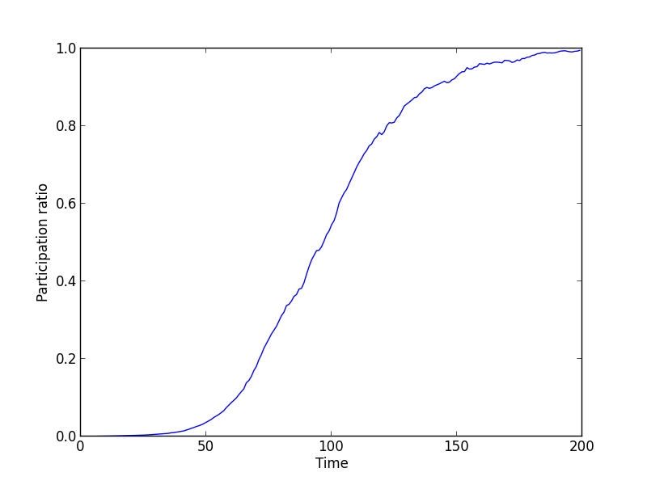

Condensation of genotypes driven by epistasis
=============================================
Epistatis and rugged landscapes favour more clonal populations compared to smooth and monotonic landscapes. This process is observed in this example, which can be found in ``condensation.py``.

After importing the modules, we set up the population::

   L = 64                                                       # simulate 64 loci
   pop = ffpop.haploid_highd(L)                                 # produce an instance of haploid_lowd with L loci
   pop.outcrossing_rate = 0                                     # make the species asexual
   pop.set_random_epistasis(0.05)                               # add a random epistatic effect
   pop.set_allele_frequencies(np.ones(L)*0.5, 10000)            # initialize the population in LD with allele frequencies 1/2

We let the population evolve and collect statistics on fitness, clone size, and participation ratio along the way::

   pfit = pop.get_fitness_statistics()
   popstat = []
   for gen in xrange(1, 200):
       #append current statistics to the list
       pfit = pop.get_fitness_statistics()
       popstat.append([gen,pfit.mean, pfit.variance, pop.participation_ratio, pop.number_of_clones])
       
       #evolve for dt generations and clean up
       pop.evolve()
       pop.unique_clones()
       pop.calc_stat()
   
Finally, we plot some observables on the clone structure of the population, the participation ratio and the number of clones:

.. image:: ../../figures/examples/condensation_number_of_clones.png

Epistasis has the effect of reducing the number of clones over time and, equivalently, increasing the participation ratio.
After 200 generations, the number of clones is :math:`\mathcal{O}(1)`.
