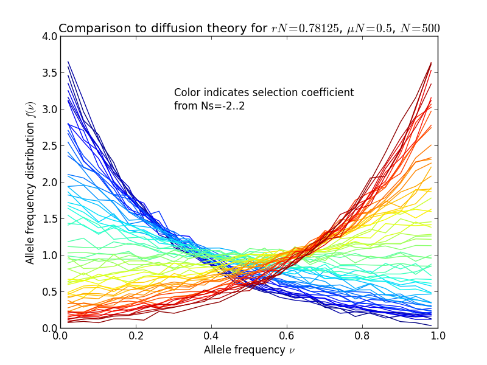

Mutation-selection balance
=============================================

For sites under selection, both genetic drift and selection influence the fate
of new alleles. Similar to the example for ``haploid_lowd``, this example shows
how to measure the mutation-selection balance in the allele frequency spectra.
The full script for this example can be found in the examples folder, in
``mutation_selection_balance_highd.py``.

After loading the modules, we start off by setting parameters and constructing
the class::

   N = 500                             # population size
   L = 64                              # number of loci
   s = np.linspace(-2 ,2, L) / N       # additive selection coefficients for L loci, scaled to N
   mu = 0.5 / N                        # mutation rate, scaled to N
   r  = 50.0 / N / L                   # recombination rate for each interval between loci
   
   pop = h.haploid_highd(L)            # produce an instance of haploid_highd with L loci

We set the additive fitness landscape. Note that the recombination rate is high
enough for loci to be unlinked::

   pop.set_fitness_additive(0.5 * s)

.. note:: FFPopSim models fitness landscape in a +/- rather than 0/1 basis, hence the factor 0.5

We then set the mutation and recombination rates::

   pop.mutation_rate = mu                   # mutation rate
   pop.recombination_model = h.CROSSOVERS   # recombination model
   pop.outcrossing_rate = 1                 # obligate sexual
   pop.crossover_rate = r                   # crossover rate

We initialize the population in linkage equilibrium with allele frequencies 0.5::

   pop.carrying_capacity = N           # set the population size
   pop.set_allele_frequencies(0.5 * np.ones(L), N)

Now we can start to evolve the population. We first let it equilibrate towards
the steady-state::

   pop.evolve(10 * N)                  # run for 10N generations to equilibrate

and we start to record the allele frequencies from now on::

   for ii in range(nsamples):
       pop.evolve(0.1 * N)                 # N / 10 generations between successive samples
   
       # get allele frequencies
       allele_frequencies[ii,:] = pop.get_allele_frequencies()

Finally, we make a histogram of the allele frequencies and plot it, together
with diffusion theory predictions::

   for locus in range(L):
   
       y,x = np.histogram(allele_frequencies[:,locus], bins=af_bins, normed='True')
   
       plt.plot(bc, y, color=plt.cm.jet(locus*4))
   
       [...]
   
       plt.plot(bc, y/diffusion_theory, color=plt.cm.jet(locus*4), ls='-')

The result is shown in the following figures, in the left panel, the
allele frequency distribution, in the right panel the same normalized by the
diffusion theory prediction:

.. image:: ../../figures/examples/mutation-selection_highd_norm.png

Diffusion theory predicts the spectrum accurately over a wide range of fitness
coefficients.
