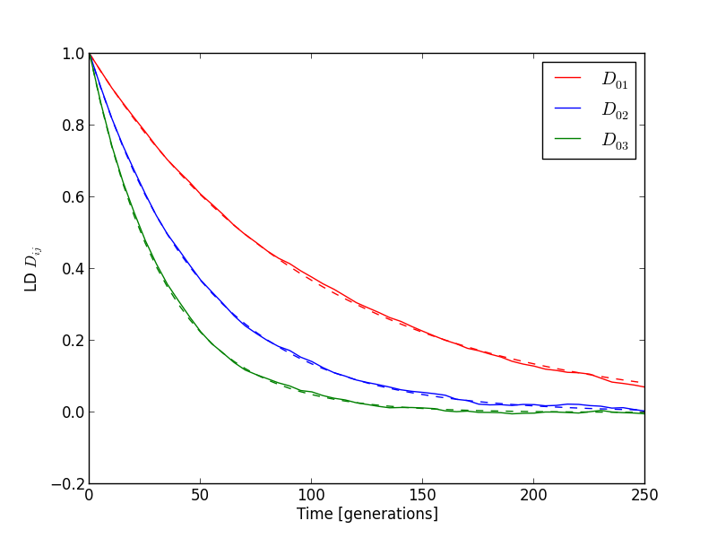

Decay of linkage disequilibrium
===============================
In recombining populations, genetic linkage decays with time. This
script initializes a population with high linkage disequilibrium (LD)
and tracks how LD. The example can be found in ``decay_of_LD.py``.

First, we load the FFPopSim module, along with the number crunching and plotting tools::

   import numpy as np
   import matplotlib.pyplot as plt
   import FFPopSim as h

Next, we set up the population::

   # specify parameters
   N = 500000                          # Population size
   L = 4                               # number of loci
   mu = 0.0                            # no new mutations
   r = 0.01                            # recombination rate
   
   ### set up
   pop = h.haploid_lowd(L)             # produce an instance of haploid_lowd with L loci
   pop.carrying_capacity = N           # set the steady-state population size
   pop.set_recombination_rates(r)      # assign the recombination rates
   pop.set_mutation_rates(mu)          # assign the mutation rate
   
   # initialize the population with N/2 individuals with genotypes 0, that is ----
   # and N/2 with the opposite genotype 2**L -1, that is ++++
   pop.set_genotypes([0, 2**L-1],[N/2, N/2])

Third, we let the population evolve and we track linkage disequilibrium via the ``get_LD`` function::

   max_gen = 50
   #get LD for locus pairs (0,1), (0,2) and (0,3)
   LD_trajectories = [[pop.generation,pop.get_LD(0,1), pop.get_LD(0,2), pop.get_LD(0,3)]]
   for ii in range(max_gen):
       pop.evolve(5)               #evolve 5 generations
       #get a new set of LD values
       LD_trajectories.append([pop.generation, pop.get_LD(0,1), pop.get_LD(0,2), pop.get_LD(0,3)])
   LD_trajectories=np.array(LD_trajectories)      #cast to an array for plotting

Fourth, we plot the resulting linkage disequilibrium curves::

   cols = ['r', 'b', 'g', 'm', 'c']
   for ii in range(LD_trajectories.shape[1]-1):
       #plot the LD from simulations and compare it to the exponential decay expected from theory
       plt.plot(LD_trajectories[:,0], LD_trajectories[:,ii+1], color=cols[ii], label=r'$D_{1'+str(ii+1)+'}$')
       plt.plot(LD_trajectories[:,0], 0.25*np.exp(-LD_trajectories[:,0]* r * (ii+1)), ls='--', color=cols[ii])
   
   plt.legend()
   plt.xlabel('Time [generations]')
   plt.ylabel('LD $D_{ij}$')
   
   plt.ion()
   plt.show()

As expected, LD decays faster if loci are further apart. The typical
plot we obtain is the following and shows complete concordance of
theory and simulations:

